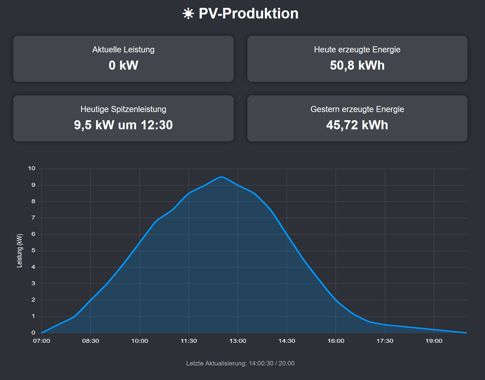

# PvOutputVisualization

Simple dashboard getting data from pvoutput and generating visualization which can be shown in AMWeb.

The background color matches the background of AMWeb, thereby integrates nicely into it:



To run you simply need either an `.env` file (for local development)

```
PVOUTPUT_API_KEY=abcdef
PVOUTPUT_SYSTEM_ID=112047
USE_MOCK_DATA=true
PROXYFIX_X_PREFIX=false
```

or inject the keys as environment variables, see [docker-compose.yml](docker-compose.yml).

The mock data mode is used to not run into rate limiting during development.

For reverse proxy use cases (do not expose directly to internet!) you may enable `PROXYFIX_X_PREFIX=true` if you run in a subpath.